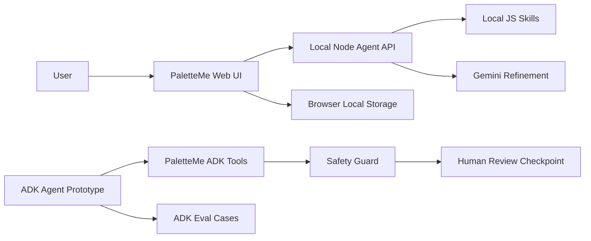

# PaletteMe Technical Mapping

This document maps PaletteMe to the five learning units from the training camp. It is written for judges and reviewers who want to see how the project applies the course concepts.

## Unit 1: Agents And Vibe Coding

PaletteMe started from a real user pain point: makeup shoppers often buy shades that look good online but do not fit their own face, undertone, or existing products.

How the project applies this unit:

- Uses a clear product spec in `SPEC.md`.
- Builds a working web demo instead of only describing an idea.
- Iterates from product story to prototype to agent-backed structure.
- Keeps the first screen focused on the usable experience, not a marketing-only landing page.

Relevant files:

- `index.html`
- `styles.css`
- `app.js`
- `SPEC.md`

## Unit 2: Agent Tools And Interoperability

PaletteMe separates the user interface, local agent API, Gemini refinement layer, and ADK prototype.

How the project applies this unit:

- Web UI calls local API endpoints.
- Local Node agent uses reusable skill modules.
- Gemini integration is optional and falls back to deterministic local logic.
- ADK prototype exposes Python tools with clear tool boundaries.

Relevant files:

- `server.mjs`
- `agent/palette-agent.mjs`
- `agent/llm/gemini-client.mjs`
- `adk_app/agent.py`

## Unit 3: Agent Skills

PaletteMe breaks the beauty assistant into reusable skills instead of one large prompt.

Implemented skills:

- Undertone Analysis Skill
- Shade Matching Skill
- Look Builder Skill
- Shopping Guard Skill
- Safety Guard Skill
- Human Review Skill

Relevant files:

- `agent/skills/undertone-analysis.mjs`
- `agent/skills/shade-matching.mjs`
- `agent/skills/look-builder.mjs`
- `agent/skills/shopping-guard.mjs`
- `adk_app/agent.py`

## Unit 4: Security, Evaluation, And Human-In-The-Loop

PaletteMe includes safety and privacy rules in both the product experience and the ADK tool structure.

How the project applies this unit:

- Safety rules are visible in the web demo.
- `safety_guard_check` screens medical-like, photo-privacy, and appearance-sensitive requests.
- `request_human_review` creates approve / revise / reject checkpoints.
- Evaluation cases test personalization, duplicate shopping, medical boundaries, and photo consent.

Relevant files:

- `EVALUATION.md`
- `tests/eval/datasets/basic-dataset.json`
- `tests/eval/eval_config.yaml`
- `tests/unit/test_dummy.py`

## Unit 5: Spec-Driven Production-Grade Development

PaletteMe is organized as a project that can move from local prototype to cloud deployment.

How the project applies this unit:

- Maintains product, submission, evaluation, and ADK planning documents.
- Keeps secrets out of Git with `.env` and `.env.example`.
- Includes local tests for deterministic ADK tool behavior.
- Uses `agents-cli` scaffold structure for future Cloud Run or Agent Runtime deployment.

Relevant files:

- `README.md`
- `SUBMISSION.md`
- `GEMINI_ADK_PLAN.md`
- `agents-cli-manifest.yaml`
- `Dockerfile`

## Architecture

## Current Verification

- `npm run agent:sample` verifies the local agent and Gemini-assisted path.
- `uv run pytest tests/unit/test_dummy.py tests/integration/test_agent.py` verifies deterministic ADK tool logic.
- `agents-cli run ...` has been used to verify the ADK agent can call PaletteMe tools.
- `agents-cli eval generate` currently requires Google Cloud Application Default Credentials before full managed eval can run.
